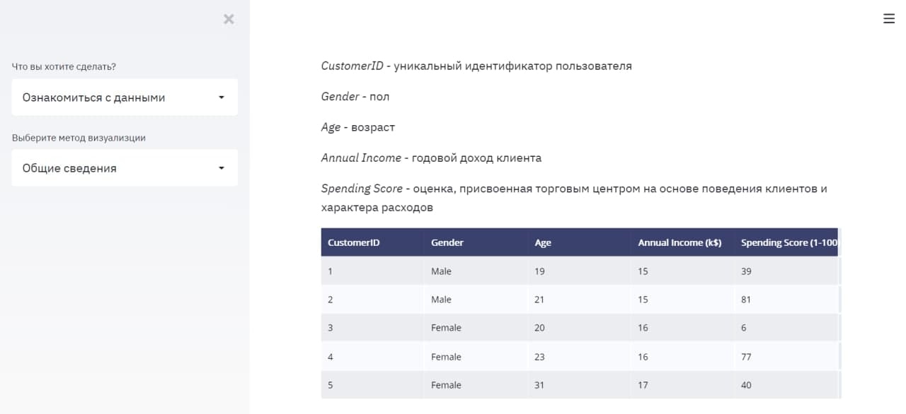

# О проекте
Проект показывает анализ кластеризации клиентов торгового центра. 

## Технологии
- Python
- Streamlit https://docs.streamlit.io/en/stable/api.html
- Plotly https://plotly.com/

## О данных
Файл "Mall_Customers.csv" содержит основную информацию (ID, возраст, пол, доход, оценка расходов) о клиентах. 

## Алгоритмы кластеризации
- Kmeans
- Сети Кохонена
- Иерархическая кластеризация

## Запуск
`streamlit run project.py`

